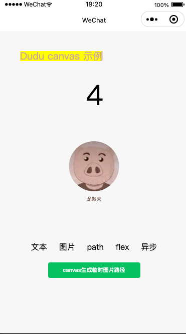
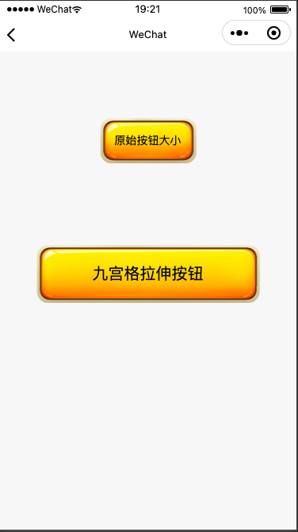
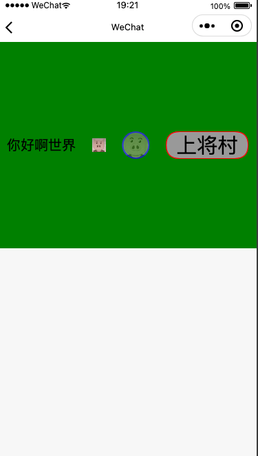
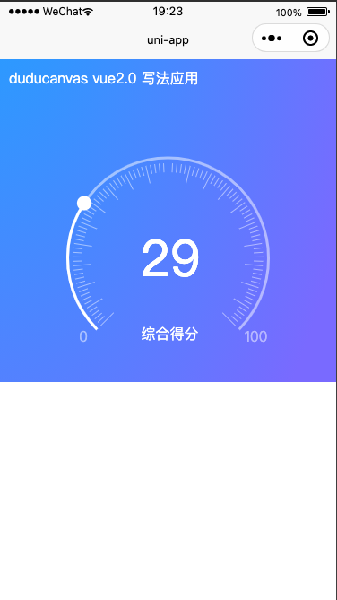
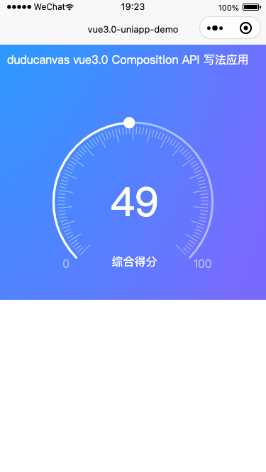

Duducanvas 小程序canvas对象化封装, 微信小程序海报生成
==================================================
----
举个栗子
----







----
uniapp vue2.0


----
uniapp vue3.0



整个目录可以用 “微信开发者工具” 直接打开
```
—— 根目录
———— mp 微信小程序目录
———— uniapp-vue3.0 demo 目录
———— uniapp-vue2.0 demo 目录
———— dist Duducanvas 编译后文件
```
==================================================

## duducanvas 使用
==================================================

### 更新说明

Duducanvas 1.3.0 已对接 小程序的  Canvas 2D 接口

为适应新版 canvas 接口，Duducanvas 变动如下：

- 取消原 new Stage 回调传递，采用 Promise 返回 stage 实例对象

- 新建顺序变更： 需要先建 Stage 后再调用 ImgLoader 并传入 stage 实例

- 需要舞台呈现渲染画面最后需要调用 `stage.update()`

- wxml 内的 canvas 标签需要添加 `type="2d"` 属性

- ImgLoader 的实例方法 get() 返回了一个对象 `{path, width, height, image}`


### 老版本请在 v1 分支查看，

> canvas 接口有哪些变化 可参考 旧版 Canvas 迁移指南 https://developers.weixin.qq.com/miniprogram/dev/framework/ability/canvas-legacy-migration.html


### 快速开始
--------------------------------------

直接下载 duducanvas.js 文件引入 或通过 [npm 包安装](#npmPackage)

### 页面内添加 canvas 标签

```
  <canvas id="myCanvas"  type="2d" style="width: 375px; height: 400px"></canvas>
```

创建舞台，注意使用的是 async/await 写法，请包含在 async 函数内

```
import { Stage } from 'duducanvas'

async function () {
    const stage = await new Stage('#myCanvas', {width: 375, height: 400})
}

```

！！如果是在自定义组件内则需要传 this 组件实例

```
import { Stage } from 'duducanvas'

async function () {
    const stage = await new Stage('#myCanvas', {width: 375, height: 400})
}
```

### 添加图片

```
  import { ImgLoader, Stage, Image} from 'duducanvas'

  async function () {
      // 先获取舞台实例
      const stage = await new Stage('#myCanvas', {width: 375, height: 400})

      // 加载图片时需要将 stage 舞台实例传入 ImgLoader
      const loader = await new ImgLoader(stage.canvas, [
        {
          id: 'avatar',
          src: '/image/132.jpeg'
        }
      ])

      // 添加图片，
      const avatar = new Image({
        image: loader.get('avatar'),
        width: 100, 
        height: 100,
      })
      // 将头像变成圆形
      avatar.borderRadius = '100%'
      
      // 添加至舞台
      stage.addChild(avatar)
      stage.update()
  }
  
```

### 添加文本

```
import { Stage, Text } from 'duducanvas'

async function(){
  const stage = await new Stage('#myCanvas', {width: 375, height: 400})
  const t1 = new Text()
  t1.text = '你好世界Hello'
  t1.color = 'red'
  t1.x = 100
  t1.y = 300
  // 添加至舞台
  stage.addChild(t1)
  stage.update()
}

```

### 添加形状

```
  const shape = new Shape()
  shape.graphics.fillStyle('green')
  shape.graphics.fillCircle(160, 160, 40)
  stage.addChild(shape)
  stage.update()
```

### Shape内可以画多个图形形状

```
  const muliShape = new Shape()
  muliShape.graphics
  .fillStyle('red')
  .fillRect(10, 110, 100, 50)
  .fillStyle('yellow')
  .fillCircle(10, 180, 30, 40)
  .fillStyle('green')
  .fillRect(10, 220, 40, 20)
  stage.addChild(muliShape)
  stage.update()
```

### 获取 context 直接操作 canvas 

如果封装的 api 无法满足业务需求，可直接操作 context 手动绘制

stage 实例属性内有 canvas 和 context 属性

```
  const stage = await new Stage('#myCanvas', {width: 375, height: 400})
  stage.context.fillStyle = 'blue'
  stage.context.fillRect(50, 100, 100, 100)
```

### 重新渲染舞台

***异步添加的元素***，需要手动调用 stage.update 方法

```
  // 重新渲染舞台
  stage.update()
```


### 类

- ImgLoader 图片加载
- Stage 舞台
- DisplayObject 显示对象
- Container 容器
- Group 组
- Image 图片
- Shape 形状
- Sprite 特殊图像
- Text 文本

### 注意事项

- Shape 类没有没有自动计算 width 与 height 属性，如有需要可自行主动设置
- Group 类没有自动计算 width 与 height 属性，可通过实例方法 getBound 获取 {left, top, right, bottom}
- flex 只实现了简单的布局功能，并未完全实现 flex 功能，flex完全体非常复杂，用都还没用明白


### 小程序 canvas 海报生成注意事项
--------------------------------------

- 网络图片必须先通过 getImageInfo 下载后才能绘制
- wx.canvasToTempFilePath 需要传递 canvas 对象， 旧版只需要传递 canvasId
- 微信头像需要下载后上传至自己的服务器绘制，直接使用微信服务器上的头像绘制时某些 Android 机型上会下载超时导致绘制失败
- canvas page页面下不能嵌在Component组件内，否则某些机型会导致绘制失败
- canvas 不能像h5中的canvas那样通过style来缩小，所以为了生成海报不模糊必须将 canvas 至少设置放大两倍，然后将canvas通过 css position 负值移到屏幕外，绘制后可以直接通过image标签来实现预览

### 微信小程序的重大变化


以前生成海报需要 canvas 来合成图像，是因为小程序是由 WebView 渲染的 

小程序引入了新的 Skyline 渲染架构，底层应该是用了 Skia 来渲染，

Skyline 理论上就可以直接输出图而不用 canvas 了

当然了现在 WebView 渲染器与 Skyline 渲染器 现在是共存的，复杂度大大上升，bug 是必须有的

还有一个就是小程序新的 glass-easel 组件框架，和 Skyline 渲染器 组合就成了跨平台框架，理论上是这样 !^_^

<a name="npmPackage"></a>
### 微信小程序开发工具内 npm 包如何安装

以 pnpm 工具举例

1. 小程序项目根目录 `pnpm init` 生成 package.json 文件

2. 安装 `pnpm add duducanvas`

3. 在微信开发者工具中，点击菜单栏的“工具” -> “构建 npm ”

4. 在小程序页面的 js 内引入  `import  { Text, Stage } from 'duducanvas'`

5. 如果引入不成功可试试  `import  { Text, Stage } from '../../miniprogram_npm/duducanvas/index'`

具体可参考微信小程序官方网站 npm 支持 https://developers.weixin.qq.com/miniprogram/dev/devtools/npm.html


### 源码 rollup 构建 
==================================================

源码在 `/mp/src` 目录下，修改后构建成功生成 `dist/duducanvas.js`

rollup版本 v2.58.1

```
rollup -c rollup.config.js
```


### 以前的纠结
--------------------------------------

以前纠结要不要为这个库添加 ui 事件

- 小程序框架js运行层与 view 渲染层完全分离的，用户操作行为触发事件需要通过中转才能到达 view 渲染层，一旦用到 touchmove 频繁操作 UI 的事件就会明显的性能下降顿挫

- 添加上了事件不就完全成了小游戏了么，那干麻不直接用小游戏框架

看过了 EaseJS 和 PixiJS 的源码后，我感觉对于事件实现也不是特别复杂，但小程序的 canvas bug 还是比较多的... 到现在 OffscreenCanvas 都没办法融合到 canvas-2d 上，无语了...

算了再等等吧

### todo

- typescript
- Matrix 属性计算

### 资料参考
- 小程序 canvas 开发文档 https://developers.weixin.qq.com/miniprogram/dev/api/canvas/Canvas.html
- 小程序开发工具 https://developers.weixin.qq.com/miniprogram/dev/devtools/download.html
- canvas 参考手册  https://www.w3school.com.cn/tags/html_ref_canvas.asp
- canvas API https://developer.mozilla.org/zh-CN/docs/Web/API/Canvas_API


