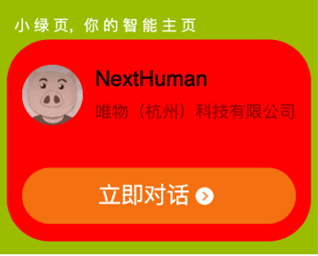
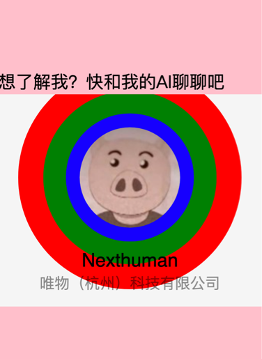
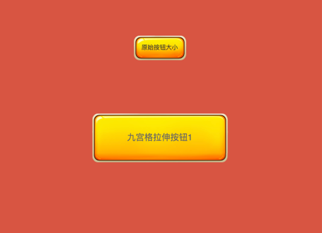
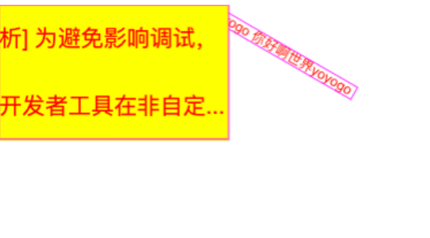

Duducanvas 微信小程序海报生成 canvas 对象化封装
==================================================
----
举个栗子
----









目录结构

```
—— 根目录
———— mp-ts 微信小程序目录，可直接使用微信开发者工具打开
———— dist Duducanvas 编译后 js 文件 及其 ts 类型文件及
```


==================================================

## duducanvas 使用
==================================================

### 更新说明

Duducanvas 1.4.0 更新：

1. typescript 重写
2. 使用 Matrix 定位
3. Container 容器优化
4. 增加 RichText 支持多行文本


### 快速开始
--------------------------------------

直接 dist/目录下 index 文件引入 

```
import { Application } from 'dist/index';
```

或通过 [npm 包安装](#npmPackage)

```
import { Application } from 'duducanvas';
```

### 页面内添加 canvas 标签

wxml 文件内：

```
  <canvas type="2d" id="myCanvas" width="{{canvasWidth}}" height="{{canvasHeight}}" style="width: {{canvasWidth / 2 }}px; height: {{canvasHeight / 2}}px;"/>

```

ts 文件内, 设置画布的宽/高都要放大一倍：

```
const getCanvasSize = () => {
    // 根据屏幕宽度计算 canvas 宽度
    const systemInfo = wx.getWindowInfo();
    const screenWidth = systemInfo.windowWidth;
    const designWidth = 750;
    const designHeight = 1024;
    // 宽高放大一倍
    const canvasWidth = screenWidth * 2;
    // 高度比例计算
    const canvasHeight = ((screenWidth / designWidth) * designHeight) * 2;
    // ratio 用于计算缩放比例，用于尺寸与定位
    const ratio = canvasWidth / 210
    return {
        canvasWidth,
        canvasHeight,
        ratio
    }
}

Component({
    data: {
        canvasWidth: 0,
        canvasHeight: 0
    },
    lifetimes: {
        async ready() {
            const { canvasWidth, canvasHeight, ratio } = getCanvasSize();

            this.setData({
                canvasWidth: canvasWidth,
                canvasHeight: canvasHeight
            });
        }
    }
})

```

这样 canvas 算是设置好了，要点是 canvas 尺寸放大一倍，再通过style 样式缩小至 page 尺寸


## 创建 Application 和 stage 

width / height 取上面计算出的值 canvasWidth 与 canvasHeight

**app.init 是异步的**

```
import { Application } from 'dist/index';

const app = new Application('#myCanvas', { width: canvasWidth, height: canvasHeight });
const stage = await app.init();

```

如果是在自定义组件内 Application 第三个参数则需要传 this 组件实例，否则会找不到 canvas 


### 添加图片

```
  import { ImgLoader, Stage, Image} from 'dist/index'

  const app = new Application('#myCanvas', {width: canvasWidth, height: canvasHeight});
  const stage = await app.init();
  if(!stage){
    return
  }
  // 先加载(下载图片)
  const loader = new ImgLoader(stage.canvas, [
    {
      id: 'avatar',
      src: '../../assets/avatar.jpeg'
    }
  ])
  await loader.load();
  
  const avatarTexture = loader.get('avatar')
  if (!avatarTexture) {
    return;
  }
  const avatar = new Image({
    image: avatarTexture.image,
    width: 50,
    height: 50
  }) 

  stage.addChild(avatar)
  stage.update()

```

**注意**: 添加完图片后需要 `stage.update()`

### 添加文本

```
import { Stage, Text } from 'dist/index'

const t1 = new Text()
t1.text = '你好世界Hello'
t1.color = 'red'
t1.x = 100
t1.y = 300
// 添加至舞台
stage.addChild(t1)
stage.update()

```

### 添加多行文本

```
import { Stage, RichText } from 'dist/index'

const rtText = new RichText()
rtText.text = `小程序提供了一个的应用开发框架和丰富的组件及API，帮助开发者在微信中开发具有原生 APP 体验的服务`
rtText.lineClamp = 2
rtText.wrapWidth = 200
rtText.fontSize = 20
rtText.lineGap = 10

stage.addChild(rtText)
stage.update();
```

多行文本可设置 lineGap、 lineClamp、letterSpace 


### 添加形状

```
import { Stage, TexShapet } from 'dist/index'

const shape = new Shape()
shape.graphics.fillStyle('pink')
shape.graphics.fillCircle(160, 160, 40)
stage.addChild(shape)
stage.update()

```

### Shape内可以画多个图形形状

```
  const muliShape = new Shape()
  muliShape.graphics
  .fillStyle('red')
  .fillRect(10, 110, 100, 50)
  .fillStyle('yellow')
  .fillCircle(10, 180, 30, 40)
  .fillStyle('green')
  .fillRect(10, 220, 40, 20)
  stage.addChild(muliShape)
  stage.update()
```

### Container 容器

在绘制分享海报时最重要的是容器，容器可以包含多个子元素，并且可以设置容器的位置、大小、旋转角度等。

容器需要手动指定其宽与高

```
import { Container, Text } from 'dist/index';

const card = new Container()
card.width = 210
card.height = 210
card.backgroundColor = '#9BBD00'
card.border = '2px solid red'
card.borderRadius = 10
card.alignItems = 'center'
card.direction = 'column'
card.gap = 10

// 第一个文本，也可以是其它显示对象
const hello = new Text()
hello.text = 'Hello'

// 第二个文本，也可以是其它元素
const word = new Text()
word.text = 'World'
card.addChild(hello, word)
stage.addChild(card)
stage.update()

```

容器提供了简易的 Flex 布局，默认其内添加的子元素会横排并垂直居中


Container 允许特殊设置的属性：

* border
* borderRadius
* overflowHidden
* alignItems
* direction
* gap


### 获取 context 直接操作 canvas 

如果封装的 api 无法满足业务需求，可直接操作 context 手动绘制

stage 实例属性内有 canvas 和 context 属性

```
  const stage = await new Stage('#myCanvas', {width: 375, height: 400})
  stage.context.fillStyle = 'blue'
  stage.context.fillRect(50, 100, 100, 100)
```

### 重新渲染舞台

***异步添加的元素***，需要手动调用 stage.update 方法

```
  // 重新渲染舞台
  stage.update()
```


### 常用类

- ImgLoader 图片加载
- Stage 舞台
- Container 容器
- Text 文本
- RichText 多行文本
- Image 图片
- Shape 形状
- Sprite 特殊图像

### 注意事项

- Shape 类没有没有自动计算 width 与 height 属性，如有需要可自行主动设置
- Container 只实现了简单的布局功能，并未完全实现 flex 功能


### 小程序 canvas 海报生成注意事项
--------------------------------------

- 网络图片必须先通过 getImageInfo 下载后才能绘制
- wx.canvasToTempFilePath 需要传递 canvas 对象， 旧版只需要传递 canvasId
- 微信头像需要下载后上传至自己的服务器绘制，直接使用微信服务器上的头像绘制时某些 Android 机型上会下载超时导致绘制失败
- canvas page页面下不能嵌在Component组件内，否则某些机型会导致绘制失败
- canvas 不能像h5中的canvas那样通过style来缩小，所以为了生成海报不模糊必须将 canvas 至少设置放大两倍，然后将canvas通过 css position 负值移到屏幕外，绘制后可以直接通过image标签来实现预览
- 在微信小程序中，绘制海报如果需要 canvas 不可见，*不能直接设置其 display:none* 而是需要将其移到屏幕外，否则某些手机上会绘制失败

### 微信小程序的重大变化


以前生成海报需要 canvas 来合成图像，是因为小程序是由 WebView 渲染的 

小程序引入了新的 Skyline 渲染架构，底层应该是用了 Skia 来渲染，

Skyline 理论上就可以直接输出图而不用 canvas 了

当然了现在 WebView 渲染器与 Skyline 渲染器 现在是共存的，复杂度大大上升，bug 是必须有的

还有一个就是小程序新的 glass-easel 组件框架，和 Skyline 渲染器 组合就成了跨平台框架，理论上是这样 !^_^

<a name="npmPackage"></a>
### 微信小程序开发工具内 npm 包如何安装

以 pnpm 工具举例

1. 小程序项目根目录 `pnpm init` 生成 package.json 文件

2. 安装 `pnpm add duducanvas`

3. 在微信开发者工具中，点击菜单栏的“工具” -> “构建 npm ”

4. 在小程序页面的 js 内引入  `import  { Text, Stage } from 'duducanvas'`

5. 如果引入不成功可试试  `import  { Text, Stage } from '../../miniprogram_npm/duducanvas/index'`

具体可参考微信小程序官方网站 npm 支持 https://developers.weixin.qq.com/miniprogram/dev/devtools/npm.html

uniapp 内引入 npm 包也类似操作，只是不需要构建 npm

具体可参考 https://uniapp.dcloud.net.cn/tutorial/page-script.html#npm支持


### 在 uniapp 中使用

1. 在 uniapp 项目根目录 `pnpm install duducanvas`

2. 在 script 内引入 `import { Application } from 'duducanvas'`;

以下是 uniapp vue3.0 内使用的 demo

index.vue 文件：
```
<template>
	<canvas type="2d" id="myCanvas" :width="canvasWidth" :height="canvasHeight" :style="{width: `${canvasWidth/2}px`, height: `${canvasHeight / 2}px`}"/>
</template>

<script setup>
	import {onMounted, ref} from 'vue'
	import { Application, RichText, Container } from 'duducanvas';
	const getCanvasSize = () => {
	    // 根据屏幕宽度计算 canvas 宽度
	    const systemInfo = wx.getSystemInfoSync();
	    const screenWidth = systemInfo.windowWidth;
	    const designWidth = 750;
	    const designHeight = 1024;
	    // 宽高放大一倍
	    const canvasWidth = screenWidth * 2;
	    // 高度比例计算
	    const canvasHeight = ((screenWidth / designWidth) * designHeight) * 2;
	    // ratio 用于计算缩放比例，用于尺寸与定位
	    const ratio = canvasWidth / 210
	    return {
	        canvasWidth,
	        canvasHeight,
	        ratio
	    }
	}
	
	const canvasInfo = getCanvasSize();
	const canvasWidth = ref(canvasInfo.canvasWidth)
	const canvasHeight = ref(canvasInfo.canvasHeight)
	
	const init = async ()=> {
		const app = new Application('#myCanvas', { width: canvasWidth.value, height: canvasHeight.value });
		const stage = await app.init();
		if(!stage){
			return;
		}
		
		stage.backgroundColor = 'green'
		
		const container = new Container()
		container.width = canvasWidth.value * .5;
		container.height = canvasHeight.value * .5;
		container.backgroundColor = 'pink'
		
		const rtText = new RichText()
		rtText.text = `小程序提供了一个的应用开发框架和丰富的组件及API，帮助开发者在微信中开发具有原生 APP 体验的服务`
		rtText.lineClamp = 2
		rtText.wrapWidth = 200
		rtText.fontSize = 20
		rtText.lineGap = 10
		
		container.addChild(rtText)
		stage.addChild(container)
		stage.update();
	}
	
	onMounted(()=>{
		init()
	})
</script>
```

在 uniapp vue2.0 中使用方法类似

### 源码 tsc 构建 
==================================================

源码在 `/mp-ts/miniprogram/src` 目录下，修改后构建成功生成 `dist/`


```
pnpm build
```


### 纠结
--------------------------------------

纠结要不要为这个库添加 ui 事件

小程序框架 js 运行层与 view 渲染层完全分离，用户操作行为触发事件需要通过中转才能到达 view 渲染层，一旦用到 touchmove 频繁操作 UI 的事件就会明显的性能下降顿挫

但小程序新 skyline 渲染引擎倒是解决了这个问题，但还不成熟，成熟后再看看加不加 ui 事件


算了再等等吧

### 资料参考
- 小程序 canvas 开发文档 https://developers.weixin.qq.com/miniprogram/dev/api/canvas/Canvas.html
- 小程序开发工具 https://developers.weixin.qq.com/miniprogram/dev/devtools/download.html
- canvas 参考手册  https://www.w3school.com.cn/tags/html_ref_canvas.asp
- canvas API https://developer.mozilla.org/zh-CN/docs/Web/API/Canvas_API


### 老版本请在 v1 分支查看，

> canvas 接口有哪些变化 可参考 旧版 Canvas 迁移指南 https://developers.weixin.qq.com/miniprogram/dev/framework/ability/canvas-legacy-migration.html
